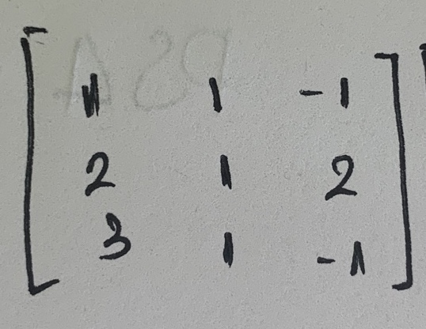
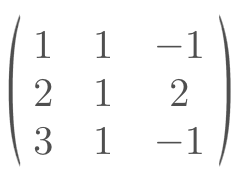

# Matrix Recognition Computer Vision

### Purpose
This project is attempting to create a tool using computer vision to recognize images (hand-written) of matrices and 
translate it into LaTeX code snippet. 

### Library
* OpenCV : image processing
* Tesserate OCR: for recognizing characters

 
